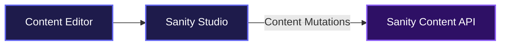
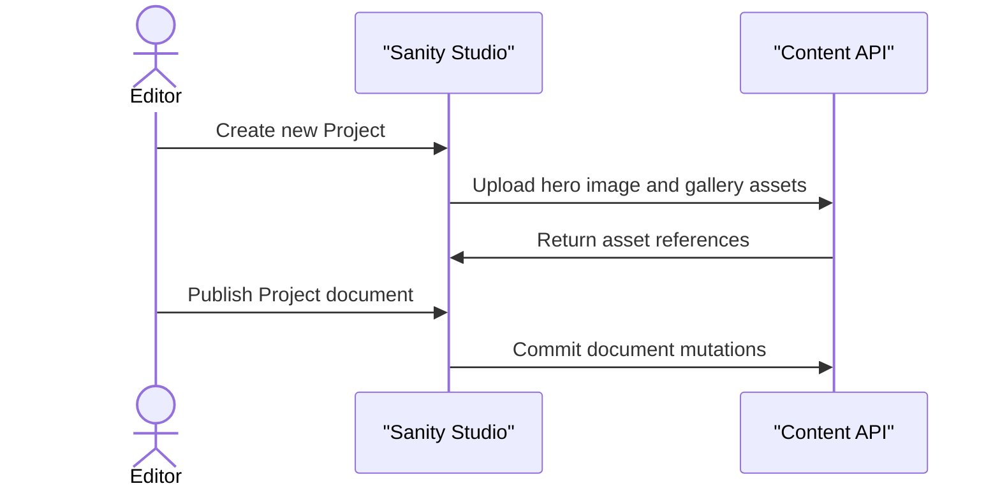

# ECAD

ECAD is a centralized content management environment built to help teams organize and publish their design portfolio, company culture, and team directories. It provides a structured editing interface that ensures content remains consistent while allowing content managers to easily update project galleries, team member profiles, and core site pages.

## System Architecture



## Usage

To run the studio locally, navigate to the studio directory and start the development server. The local server will build the temporary runtime and open the studio interface in your default browser.

```bash
cd apps/studio
npm install
npm run dev
```

Once the server is running, content editors can log in to view the workspace. From the left sidebar, users can navigate through the Content and Team structures, configure singleton pages like the Privacy Policy, and create new portfolio projects.

To deploy the latest schema changes to the production environment, use the deploy script.

```bash
npm run deploy
```

## Features

- **Portfolio Project Management**: Teams can create detailed project records, upload image galleries, assign typologies like residential or commercial, and track project status.



- **Dynamic Team Directories**: Content managers can organize staff into current and former team members, assign portraits, and control display ordering directly from the studio list views.
- **Custom Page Builder**: Editors can manage top-level pages like the Culture and Work pages using rich text blocks, call-to-action sections, and media heroes that support both images and video content.
- **Strong Validation**: The studio enforces data integrity by requiring specific fields based on document state, ensuring team members have roles and start dates before they can be published.

## Technologies Used

| Technology            | Purpose                                                |
| :-------------------- | :----------------------------------------------------- |
| **Sanity Studio**     | Real-time content editing environment                  |
| **React**             | Frontend UI framework for the studio                   |
| **TypeScript**        | Static typing for schema definitions and configuration |
| **Styled Components** | Component-level styling and visual design              |

## Badges

[](https://www.typescriptlang.org/)
[](https://reactjs.org/)
[](https://www.sanity.io/)

[](https://dokugen.samueltuoyo.com)
